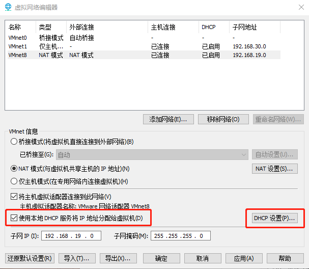

<center><h1>Linux</h1></center>

<div style="border-bottom: none;"><center><h3>目录</h3></center></div>

[TOC]

<div style="page-break-after: always;"></div>

# 第1章 Linux简介

## 1.1 Linux简介

**Linux简介**

`Linux`，全称`GNU/Linux`，是一套免费使用和自由传播的类`UNIX`操作系统，其内核由Linus Benedict Torvalds于1991年首次发布，它主要受到`MINIX`和`UNIX`思想的启发，是一个基于`POSIX（Portable Operating System Interface）`的多用户、多任务、支持多线程和多CPU的操作系统。它能运行主要的`UNIX`工具软件、应用程序和网络协议。Linux继承了UNIX以网络为核心的设计思想，是一个性能稳定的多用户网络操作系统。Linux有上百种不同的发行版，如`Debian`、`Red Hat`、`Ubuntu`、`SuSE`和`CentOS`等。


`Linux`操作系统性能稳定，并且是开源的操作系统软件。它的防火墙相关的组件保证了系统的安全，且配置简单、性能高效。在很多企业网络中追求速度和安全，`Linux`不仅仅是被网络运维人员当作服务器使用，也可以作为网络防火墙。

`Linux`具有开放源码、没有版权、技术社区用户多等特点，用户可以通过网络或其他途径免费获得，并可以任意修改其源代码，这是其他的操作系统所做不到的。正是由于这一点，来自全世界的无数程序员参与了`Linux`的修改、编写工作，程序员可以根据自己的兴趣和灵感对其进行改变，这让`Linux`吸收了无数程序员的精华，不断壮大。尤其系统中内嵌网络协议栈，经过适当的配置就可实现路由器的功能。这些特点使得`Linux`成为开发路由交换设备的理想开发平台。


**Linux发展史**

20世纪80年代，计算机硬件的性能不断提高，PC的市场不断扩大，当时可供计算机选用的操作系统主要有`UNIX`、`DOS`和`MacOS`这几种。`UNIX`价格昂贵，不能运行于PC；`DOS`显得简陋，且源代码被软件厂商严格保密；`MacOS`是一种专门用于苹果计算机的操作系统。此时，计算机科学领域迫切需要一个更加完善、强大、廉价和完全开放的操作系统。由于供教学使用的典型操作系统很少，因此当时在荷兰当教授的美国人Andrew S. Tanenbaum编写了一个操作系统，名为`MINIX`，为了向学生讲述操作系统内部工作原理。`MINIX`虽然很好，但只是一个用于教学目的的简单操作系统，而不是一个强有力的实用操作系统，然而最大的好处就是公开源代码。全世界学计算机的学生都通过钻研`MINIX`源代码来了解电脑里运行的`MINIX`操作系统，芬兰赫尔辛基大学大学二年级的学生Linus Torvalds就是其中一个。在吸收了`MINIX`精华的基础上，Linus于1991年写出了属于自己的`Linux`操作系统，版本为Linux 0.01，是`Linux`时代开始的标志。他利用`UNIX`的核心，去除繁杂的核心程序，改写成适用于一般计算机的x86系统，并放在网络上供大家下载，1994年推出完整的核心Version 1.0。至此，`Linux`逐渐成为功能完善、稳定的操作系统，并被广泛使用。

<div style="page-break-after: always;"></div>

## 1.2 Linux内核

**Linux内核**


这幅漫画是以一个房子的侧方刨面图来绘画的,使用这样的房子来代表`Linux`内核。

作为一个房子，最重要的莫过于地基。地基（底层）由一排排的文件柜组成，井然有序，文件柜里放置着文件。左上角，有一只胸前挂着421号牌的小企鹅，它表示着`PID（Process ID）`为421的进程正在查看文件柜中的文件，这代表系统中正有一个进程在访问文件系统。

在右下角有一只小狗，它是看门狗`watchdog`，这代表对文件系统的监控。


看完了地基，接下来来看地基上面的一层。


这一层最引人瞩目的莫过于中间的一块垫子，众多小企鹅在围着着桌子坐着，这个垫子的区域代表进程表。

左上角有一个小企鹅站着，仿佛在说些什么，这显然是一位家长式的人物，不过看起来周围坐的那些小企鹅不是很听话。它代表着`Linux`内核中的初始化（init）进程，也就是常说的PID为1的进程。桌子上坐的小企鹅都在等待状态（wait）中，等待工作任务。

垫子（`进程表`）两旁有两只小狗，它们会监控小企鹅的状态（`监控进程`），当小企鹅们不听话时，它就会汪汪地叫喊起来。


在这层的左侧，有一只号牌为1341的小企鹅守在门口，门上写着80，说明这个PID为1341的小企鹅负责接80端口，也就是常说的HTTP端口。小企鹅头上有一片羽毛，这片羽毛大有来历，它是著名的`HTTP`服务器`Apache`的Logo。


向右可以看到这里仍有一扇门，门上写着21，但是看起来这扇门似乎年久失修，上面的门牌号都歪了，门口也没人守着。看起来这个21端口的`FTP`协议有点老旧了，目前用的人也比以前少了，以至于这里都没人接待了。


而在最右侧的一个门牌号22的门的待遇就大为不同，居然有一只带着墨镜的小企鹅在守着，看起来好酷啊，它是黑衣人叔叔吗？为什么要这么酷的一个企鹅呢，因为22端口是`SSH`端口，是一个非常重要的远程连接端口，通常通过这个端口进行远程管理，所以对这个端口进来的人要仔细审查。


在图片的左上角，有一个向下台阶。进程们可以通过这个台阶，到文件系统中去读取文件，进行操作。


在这一层中，有一个身上写着217的小企鹅，它正满头大汗地看着自己的手表。这只小企鹅就是定时任务`crontab`，它会时刻关注时间，查看是否要去做某个工作。


在图片的中部，有两个小企鹅扛着`管道（pipeline）`在行走，一只小企鹅可以把自己手上的东西通过这个管道传递给后面的小企鹅。不过怎么看起来前面这只企鹅累得满头大汗，而后面那只企鹅似乎游刃有余。


在这一层还有另外的一个小企鹅，它手上拿着一杯红酒，身上写着411，看起来有点不胜酒力。它就是`Wine`，可以执行一些来自`Windows`的任务。


在一层之上，还有一个跃层，这里有很多不同的屏幕，每个屏幕上写着`TTY（终端）`。最左边`tty4`上输入了`fre`，这是想输入freshmeat吗？旁边的`tty2`和`tty3`就正常多了，看起来是比较正常的命令。`tty7`显示的图形界面，图形界面（x-window）一般就在7号终端。`tty5`和`tty6`是空的，这表示这两个终端没人用。


<div style="page-break-after: always;"></div>

## 1.3 虚拟机

**虚拟机（Virtual Machine）**

虚拟机指通过软件模拟的具有完整硬件系统功能的、运行在一个完全隔离环境中的完整计算机系统。在实体计算机中能够完成的工作在虚拟机中都能够实现。在计算机中创建虚拟机时，需要将实体机的部分硬盘和内存容量作为虚拟机的硬盘和内存容量。每个虚拟机都有独立的CMOS、硬盘和操作系统，可以像使用实体机一样对虚拟机进行操作。

虚拟机安装之后可以在虚拟机中安装`Linux`操作系统，常见的虚拟机软件有`VirtualBox`、`VMware`等。


**VMWare**

通过`VMWare`官网注册账号并下载合适版本的Windows系统虚拟机。

<https://my.vmware.com/cn/web/vmware/downloads/info/slug/desktop_end_user_computing/vmware_workstation_pro/15_0#product_downloads>


**CentOS**

通过`CentOS`官网可下载`CentOS`操作系统`.iso`镜像文件。

<https://www.centos.org/download/>


打开安装好的`VMWare`虚拟机，选择`创建新的虚拟机`。


<div style="page-break-after: always;"></div>

## 1.4 Linux网络配置

**网络配置**

给新安装的`CentOS`操作系统配置网络，有了网络之后在虚拟局域网内`CentOS`这一台实例就相当于一台局域网服务器了。





重启`CentOS Linux`，登录后打开终端（terminal），切换到`root`用户：

```shell
su -
```

进入网络配置目录，查看当前目录文件，并配置网络文件：

```shell
# 进入网络配置文件目录
cd /etc/sysconfig/network-scripts
# 查看当前目录文件
ls
# 编辑网络配置文件
vim ifcfg-ens33
```

进入`ifcfg-ens33`文件后，按`i`键可对文本进行编辑：

```
TYPE="Ethernet"
PROXY_METHOD="none"
BROWSER_ONLY="no"
BOOTPROTO="none"
DEFROUTE="yes"
IPV4_FAILURE_FATAL="yes"
NAME="ens33"
UUID=29927ccf-8e41-4880-8271-bfbecccd4fd4
DEVICE="ens33"
ONBOOT="yes"
IPADDR=192.168.19.11
NETMASK=255.255.255.0
GATEWAY=192.168.19.2
DNS1=192.168.19.2
DNS2=8.8.8.8
```

配置完成后，按`ESC`键，输入`:wq`进行保存并退出。

重启`CentOS`即可完成配置：

```shell
reboot
```

重启后可通过`ping`命令检查网络是否畅通：

```shell
ping baidu.com
```


<div style="page-break-after: always;"></div>

## 1.5 终端工具

**MobaXterm**

实际业务中使用较多的是终端工具连接远程服务器，较为常见的`Linux`服务器终端连接工具有`Xshell`、`MobaXterm`、`putty`等等。其中`MobaXterm`对个人免费使用，且功能齐全。

通过`MobaXterm`官网<https://moba.en.softonic.com/download>下载并安装对应版本：


远程连接`Linux`服务器之后即可使用命令操作`Linux`操作系统。

<div style="page-break-after: always;"></div>

# 第2章 文件与目录管理

## 2.1 Linux目录

**root目录**

`root`目录相当于`Windows`中的`我的电脑`。

```shell
# 进入root目录
cd /root
# 查看当前目录列表
ls
# 返回上一级目录
cd ..
ls
```

| 目录名 | 描述                                                         |
| :----- | ------------------------------------------------------------ |
| /bin   | 二进制应用程序目录，其中包含二进制文件CentOS系统所有用户使用的命令 |
| /boot  | 开始启动引导目录，启动配置文件，其中包括了Linux内核文件与开机所需要的文件 |
| /dev   | 设备目录，设备相关的文件和目录，其中包括了所有应用程序的配置文件和启动/停止某个程序的shell脚本 |
| /etc   | 配置文件目录，配置文件、启动脚本等文件                       |
| /home  | 本地用户目录，所有不同权限的系统用户可在home目录分配存储个人用户的文件和资料。 |
| /lib   | 系统使用的函数库的目录，程序在执行过程中，需要调用一些额外的参数时需要函数库的协助 |
| /media | 挂载可移动介质，诸如CD、数码相机、软盘、光盘等，可移除设备挂载目录 |
| /mnt   | 挂载文件系统，临时安装目录，系统的管理员可拥有挂载文件系统的权限 |
| /opt   | 第三方软件安装目录，第三方应用程序一般放在此目录下，但实际中通常习惯放在/usr/local目录下 |
| /proc  | 特殊动态信息目录，数据都在内存中，如系统核心、外部设备、网络状态，用以维护系统信息和状态，包括当前运行中的进程信息 |
| /root  | root用户主文件夹，其他用户均放置在/home目录下                |
| /run   | 系统运行时所需的文件，曾在/var/run中，后来拆分成独立的/run目录，重启后重新生成对应的目录数据 |
| /sbin  | 重要的系统二进制文件，包含二进制可执行文件，这个目录下的linux命令通常都是由系统管理员使用的，对系统进行维护 |
| /srv   | 服务启动后需要访问的数据目录                                 |
| /sys   | 系统文件，记录核心系统硬件信息                               |
| /tmp   | 临时文件目录，存放临时文件目录，所有用户对该目录均可读写     |
| /usr   | 应用程序放置目录，包含绝大部分所有用户都能访问的应用程序和文件 |
| /var   | 经常变化的文件，存放系统执行过程中经常改变的文件             |

<div style="page-break-after: always;"></div>

## 2.2 ls查看文件和目录列表

**ls (list)**

`ls`命令列出当前所在目录中所有文件和目录的列表，并且使用不同的命令参数可以筛选和限制展示出来的列表。

```shell
ls [OPTION]... [FILE]...
```

| 参数 | 描述                                                         |
| :--: | ------------------------------------------------------------ |
|  -a  | 表示`-all`，列出目录下的所有文件，包括以`.`开头的隐藏文件    |
|  -c  | 表示按照最后更改时间排序，可以使用`-l`显示出时间             |
|  -g  | 对输出的文件不进行排序                                       |
|  -i  | 表示`-inode`，打印出每个文件的`inode`号                      |
|  -l  | 除了文件名之外，还将文件的权限、所有者、文件大小等信息详细列出，可简写为`ll` |
|  -r  | 表示`-reverse`，按照当前排序顺序相反的顺序排列               |
|  -R  | 表示`-recursive`，递归列出所有子目录层                       |
|  -s  | 表示`-size`，以块大小为单位列出所有文件的大小                |
|  -S  | 根据文件大小排序                                             |

<div style="page-break-after: always;"></div>

## 2.3 cd路径操作

**cd (change directory)**

在对`Linux`目录操作过程中，可以使用`pwd (print working directory)`命令查看当前所处目录的绝对路径，`cd`命令可以切换到不同的路径。

```shell
pwd
cd [dir]
```

其中dir可以为绝对路径或相对路径。若目录名称省略，则变换至使用者的`home`目录。另外，`~`也表示为`home`目录，`.`表示目前所在的目录，`..`表示目前目录位置的上一层目录。

若每一个目录名称一个个敲出来就会显得有些繁琐，这个时候就可以使用Tab键进行自动补全。

<div style="page-break-after: always;"></div>

## 2.4 创建文件和目录

**touch**

`touch`命令用于修改文件或者目录的时间属性，包括存取时间和更改时间。若文件不存在，系统会建立一个新的文件。

```shell
touch [OPTION]... FILE...
```


**mkdir (make directory)**

`mkdir`命令用于创建目录。

```shell
mkdir [-p] dir
```

| 参数 | 描述                               |
| :--: | ---------------------------------- |
|  -p  | 确保目录名称存在，不存在的就建一个 |

<div style="page-break-after: always;"></div>

## 2.5 rm删除文件和目录

**rm (remove)**

`rm`命令用于删除一个文件或者目录。

```shell
rm [OPTION]... [FILE]...
```

| 参数    | 描述                                                         |
| :------ | ------------------------------------------------------------ |
| -f      | 表示`--force`，忽略不存在的文件和参数，不提示任何信息，强制删除 |
| -i      | 进行任何删除操作前必须先确认                                 |
| -r / -R | 表示`--recursive`，递归删除该目录下的所有目录层              |
| -d      | 表示`--dir`，删除可能包含有数据的目录                        |

<div style="page-break-after: always;"></div>

## 2.6 cp复制文件和目录

**cp (copy)**

`cp`命令用于复制文件或目录。

```shell
cp [OPTION]... [-T] SOURCE DEST
cp [OPTION]... SOURCE... DIRECTORY
cp [OPTION]... -t DIRECTORY SOURCE...
```

| 参数 | 描述                                                         |
| :--: | ------------------------------------------------------------ |
|  -f  | 覆盖已经存在的目标文件而不给出提示                           |
|  -i  | 在覆盖目标文件之前给出提示                                   |
|  -r  | 递归复制该目录下所有子目录和文件                             |
|  -p  | 除复制文件的内容外，还将修改时间和访问权限一起复制到新文件中 |
|  -d  | 复制时保留链接，链接相当于`Windows`下的快捷方式              |
|  -a  | 此选项通常在复制目录时使用，它保留链接和文件属性，并复制目录下的所有内容，其作用等同于`-dpr`参数组合 |

<div style="page-break-after: always;"></div>

## 2.7 mv移动文件和目录

**mv (move)**

`mv`命令用来为文件或目录改名、或将文件或目录移入其它位置。

```shell
mv [OPTION]... [-T] SOURCE DEST
mv [OPTION]... SOURCE... DIRECTORY
mv [OPTION]... -t DIRECTORY SOURCE...
```

| 参数 | 描述                                                         |
| :--: | ------------------------------------------------------------ |
|  -b  | 若有文件覆盖时，则覆盖前先行备份                             |
|  -f  | 表示`--force`，若目标文件已经存在，则不会询问强制覆盖        |
|  -i  | 表示`--interactive`，若目标文件已经存在，询问是否覆盖        |
|  -n  | 表示`--no-clobber`，不会覆盖已经存在的文件                   |
|  -u  | 表示`--update`，当源文件比目标文件新或者目标文件不存在时，才执行移动操作 |
|  -t  | 表示`--target`，指定`mv`的目标目录，该选项用于移动多个源文件到一个目录的情况，此时目标目录在前，源文件在后 |

<div style="page-break-after: always;"></div>

## 2.8 remame重命名文件和目录

**rename**

`rename`命令用字符串替换的方式批量改变文件名，`rename`命令支持正则表达式。

```shell
rename [options] <expression> <replacement> <file>...
```

> - expression：文件名中需要替换的字符串
> - replacement：替换的字符串
> - file：需要重命名的文件列表

<div style="page-break-after: always;"></div>

## 2.9 find查找文件和目录

**find**

`find`命令用于在指定目录下查找文件，任何位于参数之前的字符串都将被视为欲查找的目录名。如果使用该命令时，不设置任何参数，则将在当前目录下查找子目录与文件，并且将查找到的子目录和文件全部进行显示。

```shell
find [-H] [-L] [-P] [-Olevel] [-D help|tree|search|stat|rates|opt|exec] [path...] [expression]
```

`find`命令可以指定查找方式：

1. 按照文件类型查找：使用`-type`参数可以查找不同类型的文件

```shell
# 查找Desktop目录下所有d（目录）类型的文件
find ./Desktop/ -type d
```

| 文件类型 |     描述     |
| :------: | :----------: |
|    f     |   普通文件   |
|    d     |   目录文件   |
|    l     | 符号连接文件 |
|    b     |  块设备文件  |
|    c     | 字符设备文件 |
|    p     |   管道文件   |
|    s     |  套接字文件  |

2. 按照文件名查找：使用`-name`参数可以按照文件名查找，使用`!`取反可以排除指定的文件

```shell
# 查找Desktop目录下所有.txt文件
find ./Desktop/ -name *.txt
# 查找Desktop目录下除了.txt以外的文件
find ./Desktop/ ! -name *.txt
```

在查找文件时也可以直接对指定文件执行特定的操作。

```shell
# 查找Desktop目录下所有.txt文件，并执行删除操作
find ./Desktop/ -name *.txt -exec rm {} \;
```

<div style="page-break-after: always;"></div>

## 2.10 查看文件内容

**file**

`file`命令用于查看文件类型和文件的编码格式。

```shell
file [-bcLvz][-f <filename>][-m <magicfile>...][dir...]
```

| 参数 | 描述                                                         |
| :--: | ------------------------------------------------------------ |
|  -b  | 表示`--brief`，显示查看结果时，不显示文件名                  |
|  -c  | 表示`--checking-printout`，显示指令执行过程                  |
|  -f  | 表示`--files-from FILE`，列出文件中文件名的文件类型          |
|  -F  | 表示`--separator STRING`，使用指定符号替换输出文件名后默认的`:` |
|  -L  | 表示`--dereference`，查看对应软链接文件的文件类型            |
|  -z  | 表示`--uncompress`，尝试去解读压缩文件的内容                 |


**cat**

`cat`命令用于来查看文件内容。

```shell
cat [OPTION]... [FILE]...
```

| 参数 | 描述                                                  |
| :--: | ----------------------------------------------------- |
|  -A  | 表示`--show-all`，展示所有内容                        |
|  -b  | 表示`--number-nonblank`，对查看的内容的非空行进行编号 |
|  -n  | 表示`--number`，对查看的内容行数编号输出              |
|  -s  | 表示`--seueeze-blank`，将多行连续的空行压缩为一行     |


**more**

`more`命令类似`cat`，不过会以一页一页的形式显示，更方便使用者逐页阅读。空格键可以显示下一页，按`b`键可以显示上一页。

```shell
more [options] <file>...
```

| 参数 | 描述                                                 |
| :--: | ---------------------------------------------------- |
|  +n  | 从第n行开始显示                                      |
|  -n  | 一次显示的行数                                       |
|  -c  | 从顶部清屏并显示                                     |
|  -p  | 通过清除窗口而不是滚屏来对文件进行换页，与-c选项相似 |
|  -s  | 把连续的多个空行显示为一行                           |

<div style="page-break-after: always;"></div>

## 2.11 文件压缩与解压

**tar**

`tar`命令用于压缩和解压文件。

```shell
tar -czvf filename.tar.gz [file]...
tar -xzvf filename.tar.gz
```

| 参数 | 描述                       |
| :--: | -------------------------- |
|  -c  | 新建立压缩档案             |
|  -x  | 解压缩                     |
|  -t  | 查看内容                   |
|  -u  | 更新原压缩包的内容         |
|  -z  | gzip属性                   |
|  -j  | bz2属性                    |
|  -Z  | compress属性               |
|  -v  | 显示所有过程               |
|  -O  | 将文件解压缩成标准输出形式 |
|  -f  | 档案名称，此参数在最后出现 |


**zip**

`zip`命令用于压缩文件，`unzip`命令用于解压缩zip文件。

```shell
zip -r filename.zip [file]...
unzip filename.zip
```

| 参数 | 描述                                             |
| :--: | ------------------------------------------------ |
|  -d  | 从压缩文件内删除指定的文件                       |
|  -f  | 更新现有的文件                                   |
|  -F  | 尝试修复已损坏的压缩文件                         |
|  -m  | 将文件压缩并删除原始文件，即把文件移到压缩文件中 |
|  -q  | 不显示指令执行过程                               |
|  -r  | 递归处理，将指定目录下的所有文件和子目录一并处理 |
|  -v  | 显示指令执行过程或显示版本信息                   |

<div style="page-break-after: always;"></div>

# 第3章 编辑器

## 3.1 nano编辑器

**nano编辑器**

`nano`是`UNIX`系统中的一个文本编辑器，大部分`Linux`发行版本默认都安装了`nano`文本编辑器。和`vim`编辑器相比，`nano`编辑器没有那么强大，比如没有语法高亮、自动缩进等功能，但它拥有基本的查看和修改文件的功能。

```shell
nano filename
```

|   命令   | 描述                                     |
| :------: | ---------------------------------------- |
| CTRL + G | 显示`nano`编辑器的帮助窗口               |
| CTRL + C | 显示光标在文件中的位置信息               |
| CTRL + K | 剪切文本行，并将其保存在剪切缓冲区       |
| CTRL + O | 将当前文本编辑器缓冲区的内容写入文件     |
| CTRL + U | 将剪切缓冲区中的内容放入当前行           |
| CTRL + Y | 翻动到文本编辑缓冲区的上一页内容         |
| CTRL + V | 翻动到文本编辑缓冲区的下一页内容         |
| CTRL + W | 在文本编辑缓冲区中搜索单词或短语         |
| CTRL + X | 关闭当前文本编辑缓冲区，退出`nano`编辑器 |
| CTRL + T | 启动可用的拼写检查器                     |

<div style="page-break-after: always;"></div>

## 3.2 vim编辑器

**vim编辑器**

`vim`编辑器是由vi发展而来的文本编辑器，它的功能有代码补全、编译、错误跳转等，在程序开发时被广泛使用。

`vim`的命令组合是它的设计理念，同时`vim`与很多快捷键设置和正则表达式类似，可以辅助记忆，并且优化之后的`vim`针对程序员很友好。
`vim`编辑器有三种模式：

1. 命令模式：刚进入时默认为命令模式，可以查看和查找文件内容，不能修改内容。
2. 插入模式：在普通模式下按下`i`、`a`、`o`键可以进入插入模式，此时编辑器处于编辑状态，能对当前的文件内容修改。在插入模式下按`ESC`键可以回到命令模式。
3. 底线命令模式：在命令模式下输入`:`可以进入底线命令模式，此时可以对编辑后的文件进行保存、退出等操作。在底线命令模式下按`ESC`键可以回到命令模式。


<center><strong>光标移动键</strong></center>

|        命令         | 描述                 |
| :-----------------: | -------------------- |
|        ↑ / k        | 光标往上移动一格字符 |
|        ↓ / j        | 光标往下移动一格字符 |
|        ← / h        | 光标往左移动一格字符 |
|        → / l        | 光标往右移动一格字符 |
|  PageUp / CTRL + B  | 光标往上翻动一屏     |
| PageDown / CTRL + F | 光标往下翻动一屏     |
|         gg          | 光标移动到第一行     |
|          G          | 光标移动到最后一行   |
|         nG          | 光标移动到第n行      |

<center><strong>底线命令模式</strong></center>

| 命令 | 描述                                                |
| :--: | --------------------------------------------------- |
|  q   | 退出，若有修改内容，则会提示`E37：已修改但尚未保存` |
|  q!  | 表示强制退出，不会保存修改的内容                    |
|  w   | 保存修改内容                                        |
|  wq  | 保存并退出                                          |
| wq!  | 强制保存退出                                        |

<center><strong>命令模式</strong></center>

|  命令  | 描述                                 |
| :----: | ------------------------------------ |
|   x    | 删除当前光标所在位置的字符           |
|   dd   | 删除当前光标所在行                   |
|   dw   | 删除当前光标所在位置的单词           |
|   d$   | 删除当前光标所在位置至行尾的内容     |
|   J    | 删除当前光标所在行行尾的换行符       |
|   u    | 撤销前一编辑命令                     |
|   a    | 在当前光标后追加内容，切换到插入模式 |
|   A    | 在当前光标所在行行尾追加数据         |
| r char | 用char替换当前光标所在位置的单个字符 |
| R text | 用text覆盖当前光标所在位置的数据     |

<div style="page-break-after: always;"></div>

# 第4章 进程和磁盘管理

## 4.1 查看进程

**进程（Process）**

进程指的是一个具有一定独立功能的程序关于某个数据集合的一次运行活动。进程是系统进行资源分配和调度运行的基本单位。

进程实体中包含三个组成部分：

1. 程序
2. 数据
3. PCB (Process Control Block)

程序（program）与进程是有区别的，程序是静态的，进程是动态的。当程序的可执行文件被装入内存后就会变成进程。进程可以认为是执行中的程序，进程需要一定资源（如CPU时间、内存、文件、I/O设备）完成任务。这些资源可以在创建的时候或者运行中分配。一个程序可以通过`GUI (Graphic User Interface)`图形用户界面的鼠标点击、`CLI (Command-line Interface)`命令行界面输入程序名等方式运行。

`Linux`中进程的状态有五种：

1. 运行：正在运行或在运行队列中等待
2. 中断：休眠中、受阻或在等待某个条件的形成或接受到信号
3. 不可中断：收到信号不唤醒和不可运行, 进程必须等待直到有中断发生
4. 僵死：进程已终止, 但进程描述符存在, 直到父进程调用`wait4()`系统调用后释放
5. 停止：进程收到`SIGSTOP`、`SIGSTP`、`SIGTIN`、`SIGTOU`信号后停止运行


**查看进程**

在启动一个进程之后，使用`ps`命令可以查看启动软件的进程。

```shell
ps [options]
```

| 参数 | 描述                         |
| :--: | ---------------------------- |
|  -A  | 显示所有进程                 |
|  -w  | 显示加宽可以显示较多的信息   |
| -au  | 显示较详细的信息             |
| -aux | 显示所有包含其他使用者的行程 |
| -ef  | 查看全格式的全部进程         |

`ps`命令只能查看输入命令那一刻获取到的进程信息，而`top`命令可以实时监测进程信息。

```shell
top
```

| 标识    | 描述                                                         |
| :------ | ------------------------------------------------------------ |
| PID     | 进程ID                                                       |
| USER    | 进程属主名称                                                 |
| PR      | 进程优先级                                                   |
| NI      | 进程谦让度值                                                 |
| VIRT    | 进程占用的虚拟内存总量                                       |
| RES     | 进程占用的物理内存总量                                       |
| SHR     | 进程和其它进程共享的内存总量                                 |
| S       | 进程状态，D表示可中断的休眠状态、R表示运行状态、S表示休眠状态、T表示跟踪状态或停止状态、Z表示僵化状态 |
| %CPU    | 进程使用的CPU时间比例                                        |
| %MEM    | 进程使用的内存占可用内存的比例                               |
| TIME+   | 自进程启动到目前为止CPU时间总数                              |
| COMMAND | 进程所对应的命令行名称，即程序启动时的程序名                 |

<div style="page-break-after: always;"></div>

## 4.2 结束进程

**kill**

`kill`命令用于删除执行中的进程。

```shell
kill [-s sigspec | -n signum | -sigspec] pid | jobspec ... or kill -l [sigspec]
```

| 参数         | 描述                                                         |
| ------------ | ------------------------------------------------------------ |
| -l [sigspec] | 若不给出`sigspec`选项，则`-l`参数会列出全部的信息名称。常用的信息有：1 (HUP)：重新加载进程、9 (KILL)：杀死一个进程、15 (TERM)：正常停止一个进程 |
| -s sigspec   | 指定要送出的信息                                             |

`killall`命令与`kill`不同的是它会杀死指定名字的所有进程，`kill`命令用于杀死指定进程PID，需要配合`ps`使用，而`killall`直接对进程的名字进行操作，更加方便。

```shell
killall [ -Z CONTEXT ] [ -u USER ] [ -y TIME ] [ -o TIME ] [ -eIgiqrvw ] [ -s SIGNAL | -SIGNAL ] NAME...
killall -l, --list
killall -V, --version
```

| 参数                 | 描述                               |
| -------------------- | ---------------------------------- |
| -e / --exact         | 进程需要和名字完成相符             |
| -I / --ignore-case   | 忽略大小写                         |
| -g / --process-group | 结束进程组                         |
| -i / --interactive   | 结束之前询问                       |
| -l / --list          | 列出所有的信号名称                 |
| -q / --quite         | 进程没有结束时，不输出任何信息     |
| -r / --regexp        | 将进程名模式解释为扩展的正则表达式 |
| -s / --signal        | 发送指定信号                       |
| -u / --user          | 结束指定用户的进程                 |
| -v / --verbose       | 显示详细执行过程                   |
| -w / --wait          | 等待所有的进程都结束               |
| -V / --version       | 显示版本信息                       |
| --help               | 显示帮助信息                       |

<div style="page-break-after: always;"></div>

## 4.3 磁盘空间

**df**

`df`命令用于查看磁盘空间使用情况。

```shell
df [OPTION]... [FILE]...
```

| 参数 | 描述                                                    |
| :--: | ------------------------------------------------------- |
|  -a  | 表示`-all`，显示所有的文件系统，包括虚拟文件系统        |
|  -h  | 表示`--human-readable`，以易读的格式显示                |
|  -H  | `--si`，和`-h`参数一样，但是是以1k = 1000为单位         |
|  -i  | 表示`--inodes`，不用硬盘容量，而是以`inode`的数量来显示 |
|  -k  | 以kb的容量显示各文件系统，相当于`--block-size=1k`       |
|  -l  | 表示`--local`，只显示本地文件系统                       |
|  -t  | 表示`--type=TYPE`，只显示指定类型的文件系统             |
|  -T  | 表示`--print-type`，显示文件系统类型                    |
|  -x  | 表示`--exclude-type=TYPE`，不显示指定类型的文件系统     |


**du**

`du`命令用于显示文件或目录所占用的磁盘空间。

```shell
du [OPTION]... [FILE]...
du [OPTION]... --files0-from=F
```

| 参数 | 描述                                                         |
| :--: | ------------------------------------------------------------ |
|  -a  | 表示`-all`，列出所有的文件和目录容量大小，而不仅仅列出目录容量大小 |
|  -b  | 表示`--bytes`，以字节为单位列出文件和目录的容量大小          |
|  -c  | 表示`--total`，除了列出文件和目录的容量大小外，列出总的容量大小 |
|  -h  | 表示`--human-readable`，以易读的格式显示                     |
|  -k  | 以`KB`为单位                                                 |
|  -m  | 以`MB`为单位                                                 |
|  -s  | 表示`--separate-dirs`，仅列出总量，而不列出每个目录和文件的大小 |
|  -S  | 表示`--summarize`，和`-s`参数类似，但是统计时不包含子目录的容量大小 |

<div style="page-break-after: always;"></div>

# 第5章 权限管理

## 5.1 用户权限

**用户类型**

`Linux`系统是一个多用户多任务的操作系统，一般可将用户分为`root`用户和普通用户两大类。`root`是系统管理员用户，在命令行前面显示`#`，普通用户在命令行前面显示`$`。

`Linux`系统中`/etc/passwd`文件保存了系统中所有用户的主要信息，这些信息以`:`分隔。

```shell
cat /etc/passwd
```

文件中每行代表一个用户，这些用户中的绝大多数是系统或服务正常运行所必需的用户，这种用户称为系统用户或伪用户。系统用户是不能登录系统的，但是这些用户同样也不能删除，因为一旦删除，依赖这些用户运行的服务或程序就不能正常执行，会导致系统问题。

`Linux`系统中`/etc/shadow`文件保存了每个用户的信息，该文件只有`root`用户才能访问。

```shell
cat /etc/shadow
```


**添加用户**

使用`root`登录`Linux`之后就可以使用`useradd`命令添加普通用户，并通过`passwd`命令可以设置用户密码。

```shell
useradd [username]
passwd [username]
```


**修改用户**

使用`usermod`命令可以修改用户信息。

```shell
usermod -l [new_username] [old_username]
```


**删除用户**

使用`root`登录`Linux`之后就可以使用`userdel`命令删除普通用户。

```shell
userdel -rf [username]
```

| 参数 | 描述                                                  |
| :--: | ----------------------------------------------------- |
|  -f  | 表示`--force`，强制删除用户                           |
|  -r  | 表示`--remove`，删除主目录和邮件池                    |
|  -Z  | 表示`--selinux-user`，为用户删除所有的SELinux用户映射 |

<div style="page-break-after: always;"></div>

## 5.2 文件权限

**文件权限**

有时候某些文件为了安全起见，只有只读权限，没有写入权限和执行权限，而这些权限一般和用户或用户组有关。

通过`ls -l`命令可以查看文件权限相关信息：

```shell
ls -l
```


第一列表示文件读取、写入、执行相关的权限，第二列表示文件或目录的创建者/所有者，第三列表示文件或目录所在的用户组。

文件权限可分为三部分，第一部分表示文件创建者/所有者对该文件所具有的权限，第二部分表示创建者/所有者所在的组其他用户的权限，第三部分表示其他组的用户的权限。

| 权限 | 描述                                                         |
| :--: | ------------------------------------------------------------ |
|  r   | 表示read，读取权限。若是文件，表示可以读取文件内容；若是目录，表示可以浏览目录 |
|  w   | 表示write，写入权限。若是文件，表示可以新增、修改文件内容；若是目录，表示可以删除、移动目录列表 |
|  x   | 表示execute，执行权限。若是文件，表示具有执行文件的权限；若是目录，表示该用户拥有进入目录的权限 |


**chmod**

`chmod`命令可以控制用户对文件的权限的命令。

```shell
chmod [OPTION]... MODE[,MODE]... FILE...
chmod [OPTION]... OCTAL-MODE FILE...
chmod [OPTION]... --reference=RFILE FILE...
```


| 参数 | 描述                     |
| :--: | ------------------------ |
|  u   | user用户                 |
|  g   | group用户组              |
|  o   | others其他用户           |
|  a   | all全部                  |
|  +   | 在现有权限基础上增加权限 |
|  -   | 在现有权限基础上移出权限 |
|  =   | 设置成等号后的权限       |

`chmod`命令也可以使用八进制数来指定权限。文件或目录的权限位是由9个权限位来控制，每三位为一组。

