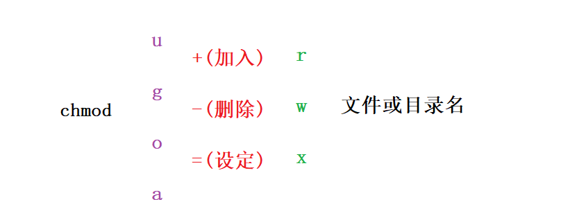

<center><h1>Linux</h1></center>

<div style="border-bottom: none;"><center><h3>目录</h3></center></div>

[TOC]


<center><strong>光标移动键</strong></center>

|        命令         | 描述                 |
| :-----------------: | -------------------- |
|        ↑ / k        | 光标往上移动一格字符 |
|        ↓ / j        | 光标往下移动一格字符 |
|        ← / h        | 光标往左移动一格字符 |
|        → / l        | 光标往右移动一格字符 |
|  PageUp / CTRL + B  | 光标往上翻动一屏     |
| PageDown / CTRL + F | 光标往下翻动一屏     |
|         gg          | 光标移动到第一行     |
|          G          | 光标移动到最后一行   |
|         nG          | 光标移动到第n行      |

<center><strong>底线命令模式</strong></center>

| 命令 | 描述                                                |
| :--: | --------------------------------------------------- |
|  q   | 退出，若有修改内容，则会提示`E37：已修改但尚未保存` |
|  q!  | 表示强制退出，不会保存修改的内容                    |
|  w   | 保存修改内容                                        |
|  wq  | 保存并退出                                          |
| wq!  | 强制保存退出                                        |

<center><strong>命令模式</strong></center>

|  命令  | 描述                                 |
| :----: | ------------------------------------ |
|   x    | 删除当前光标所在位置的字符           |
|   dd   | 删除当前光标所在行                   |
|   dw   | 删除当前光标所在位置的单词           |
|   d$   | 删除当前光标所在位置至行尾的内容     |
|   J    | 删除当前光标所在行行尾的换行符       |
|   u    | 撤销前一编辑命令                     |
|   a    | 在当前光标后追加内容，切换到插入模式 |
|   A    | 在当前光标所在行行尾追加数据         |
| r char | 用char替换当前光标所在位置的单个字符 |
| R text | 用text覆盖当前光标所在位置的数据     |

<div style="page-break-after: always;"></div>

# 第4章 进程和磁盘管理

## 4.1 查看进程

**进程（Process）**

进程指的是一个具有一定独立功能的程序关于某个数据集合的一次运行活动。进程是系统进行资源分配和调度运行的基本单位。

进程实体中包含三个组成部分：

1. 程序
2. 数据
3. PCB (Process Control Block)

程序（program）与进程是有区别的，程序是静态的，进程是动态的。当程序的可执行文件被装入内存后就会变成进程。进程可以认为是执行中的程序，进程需要一定资源（如CPU时间、内存、文件、I/O设备）完成任务。这些资源可以在创建的时候或者运行中分配。一个程序可以通过`GUI (Graphic User Interface)`图形用户界面的鼠标点击、`CLI (Command-line Interface)`命令行界面输入程序名等方式运行。

`Linux`中进程的状态有五种：

1. 运行：正在运行或在运行队列中等待
2. 中断：休眠中、受阻或在等待某个条件的形成或接受到信号
3. 不可中断：收到信号不唤醒和不可运行, 进程必须等待直到有中断发生
4. 僵死：进程已终止, 但进程描述符存在, 直到父进程调用`wait4()`系统调用后释放
5. 停止：进程收到`SIGSTOP`、`SIGSTP`、`SIGTIN`、`SIGTOU`信号后停止运行


**查看进程**

在启动一个进程之后，使用`ps`命令可以查看启动软件的进程。

```shell
ps [options]
```

| 参数 | 描述                         |
| :--: | ---------------------------- |
|  -A  | 显示所有进程                 |
|  -w  | 显示加宽可以显示较多的信息   |
| -au  | 显示较详细的信息             |
| -aux | 显示所有包含其他使用者的行程 |
| -ef  | 查看全格式的全部进程         |

`ps`命令只能查看输入命令那一刻获取到的进程信息，而`top`命令可以实时监测进程信息。

```shell
top
```

| 标识    | 描述                                                         |
| :------ | ------------------------------------------------------------ |
| PID     | 进程ID                                                       |
| USER    | 进程属主名称                                                 |
| PR      | 进程优先级                                                   |
| NI      | 进程谦让度值                                                 |
| VIRT    | 进程占用的虚拟内存总量                                       |
| RES     | 进程占用的物理内存总量                                       |
| SHR     | 进程和其它进程共享的内存总量                                 |
| S       | 进程状态，D表示可中断的休眠状态、R表示运行状态、S表示休眠状态、T表示跟踪状态或停止状态、Z表示僵化状态 |
| %CPU    | 进程使用的CPU时间比例                                        |
| %MEM    | 进程使用的内存占可用内存的比例                               |
| TIME+   | 自进程启动到目前为止CPU时间总数                              |
| COMMAND | 进程所对应的命令行名称，即程序启动时的程序名                 |

<div style="page-break-after: always;"></div>

## 4.2 结束进程

**kill**

`kill`命令用于删除执行中的进程。

```shell
kill [-s sigspec | -n signum | -sigspec] pid | jobspec ... or kill -l [sigspec]
```

| 参数         | 描述                                                         |
| ------------ | ------------------------------------------------------------ |
| -l [sigspec] | 若不给出`sigspec`选项，则`-l`参数会列出全部的信息名称。常用的信息有：1 (HUP)：重新加载进程、9 (KILL)：杀死一个进程、15 (TERM)：正常停止一个进程 |
| -s sigspec   | 指定要送出的信息                                             |

`killall`命令与`kill`不同的是它会杀死指定名字的所有进程，`kill`命令用于杀死指定进程PID，需要配合`ps`使用，而`killall`直接对进程的名字进行操作，更加方便。

```shell
killall [ -Z CONTEXT ] [ -u USER ] [ -y TIME ] [ -o TIME ] [ -eIgiqrvw ] [ -s SIGNAL | -SIGNAL ] NAME...
killall -l, --list
killall -V, --version
```

| 参数                 | 描述                               |
| -------------------- | ---------------------------------- |
| -e / --exact         | 进程需要和名字完成相符             |
| -I / --ignore-case   | 忽略大小写                         |
| -g / --process-group | 结束进程组                         |
| -i / --interactive   | 结束之前询问                       |
| -l / --list          | 列出所有的信号名称                 |
| -q / --quite         | 进程没有结束时，不输出任何信息     |
| -r / --regexp        | 将进程名模式解释为扩展的正则表达式 |
| -s / --signal        | 发送指定信号                       |
| -u / --user          | 结束指定用户的进程                 |
| -v / --verbose       | 显示详细执行过程                   |
| -w / --wait          | 等待所有的进程都结束               |
| -V / --version       | 显示版本信息                       |
| --help               | 显示帮助信息                       |

<div style="page-break-after: always;"></div>

## 4.3 磁盘空间

**df**

`df`命令用于查看磁盘空间使用情况。

```shell
df [OPTION]... [FILE]...
```

| 参数 | 描述                                                    |
| :--: | ------------------------------------------------------- |
|  -a  | 表示`-all`，显示所有的文件系统，包括虚拟文件系统        |
|  -h  | 表示`--human-readable`，以易读的格式显示                |
|  -H  | `--si`，和`-h`参数一样，但是是以1k = 1000为单位         |
|  -i  | 表示`--inodes`，不用硬盘容量，而是以`inode`的数量来显示 |
|  -k  | 以kb的容量显示各文件系统，相当于`--block-size=1k`       |
|  -l  | 表示`--local`，只显示本地文件系统                       |
|  -t  | 表示`--type=TYPE`，只显示指定类型的文件系统             |
|  -T  | 表示`--print-type`，显示文件系统类型                    |
|  -x  | 表示`--exclude-type=TYPE`，不显示指定类型的文件系统     |


**du**

`du`命令用于显示文件或目录所占用的磁盘空间。

```shell
du [OPTION]... [FILE]...
du [OPTION]... --files0-from=F
```

| 参数 | 描述                                                         |
| :--: | ------------------------------------------------------------ |
|  -a  | 表示`-all`，列出所有的文件和目录容量大小，而不仅仅列出目录容量大小 |
|  -b  | 表示`--bytes`，以字节为单位列出文件和目录的容量大小          |
|  -c  | 表示`--total`，除了列出文件和目录的容量大小外，列出总的容量大小 |
|  -h  | 表示`--human-readable`，以易读的格式显示                     |
|  -k  | 以`KB`为单位                                                 |
|  -m  | 以`MB`为单位                                                 |
|  -s  | 表示`--separate-dirs`，仅列出总量，而不列出每个目录和文件的大小 |
|  -S  | 表示`--summarize`，和`-s`参数类似，但是统计时不包含子目录的容量大小 |

<div style="page-break-after: always;"></div>

# 第5章 权限管理

## 5.1 用户权限

**用户类型**

`Linux`系统是一个多用户多任务的操作系统，一般可将用户分为`root`用户和普通用户两大类。`root`是系统管理员用户，在命令行前面显示`#`，普通用户在命令行前面显示`$`。

`Linux`系统中`/etc/passwd`文件保存了系统中所有用户的主要信息，这些信息以`:`分隔。

```shell
cat /etc/passwd
```

文件中每行代表一个用户，这些用户中的绝大多数是系统或服务正常运行所必需的用户，这种用户称为系统用户或伪用户。系统用户是不能登录系统的，但是这些用户同样也不能删除，因为一旦删除，依赖这些用户运行的服务或程序就不能正常执行，会导致系统问题。

`Linux`系统中`/etc/shadow`文件保存了每个用户的信息，该文件只有`root`用户才能访问。

```shell
cat /etc/shadow
```


**添加用户**

使用`root`登录`Linux`之后就可以使用`useradd`命令添加普通用户，并通过`passwd`命令可以设置用户密码。

```shell
useradd [username]
passwd [username]
```


**修改用户**

使用`usermod`命令可以修改用户信息。

```shell
usermod -l [new_username] [old_username]
```


**删除用户**

使用`root`登录`Linux`之后就可以使用`userdel`命令删除普通用户。

```shell
userdel -rf [username]
```

| 参数 | 描述                                                  |
| :--: | ----------------------------------------------------- |
|  -f  | 表示`--force`，强制删除用户                           |
|  -r  | 表示`--remove`，删除主目录和邮件池                    |
|  -Z  | 表示`--selinux-user`，为用户删除所有的SELinux用户映射 |

<div style="page-break-after: always;"></div>

## 5.2 文件权限

**文件权限**

有时候某些文件为了安全起见，只有只读权限，没有写入权限和执行权限，而这些权限一般和用户或用户组有关。

通过`ls -l`命令可以查看文件权限相关信息：

```shell
ls -l
```


第一列表示文件读取、写入、执行相关的权限，第二列表示文件或目录的创建者/所有者，第三列表示文件或目录所在的用户组。

文件权限可分为三部分，第一部分表示文件创建者/所有者对该文件所具有的权限，第二部分表示创建者/所有者所在的组其他用户的权限，第三部分表示其他组的用户的权限。

| 权限 | 描述                                                         |
| :--: | ------------------------------------------------------------ |
|  r   | 表示read，读取权限。若是文件，表示可以读取文件内容；若是目录，表示可以浏览目录 |
|  w   | 表示write，写入权限。若是文件，表示可以新增、修改文件内容；若是目录，表示可以删除、移动目录列表 |
|  x   | 表示execute，执行权限。若是文件，表示具有执行文件的权限；若是目录，表示该用户拥有进入目录的权限 |


**chmod**

`chmod`命令可以控制用户对文件的权限的命令。

```shell
chmod [OPTION]... MODE[,MODE]... FILE...
chmod [OPTION]... OCTAL-MODE FILE...
chmod [OPTION]... --reference=RFILE FILE...
```



| 参数 | 描述                     |
| :--: | ------------------------ |
|  u   | user用户                 |
|  g   | group用户组              |
|  o   | others其他用户           |
|  a   | all全部                  |
|  +   | 在现有权限基础上增加权限 |
|  -   | 在现有权限基础上移出权限 |
|  =   | 设置成等号后的权限       |

`chmod`命令也可以使用八进制数来指定权限。文件或目录的权限位是由9个权限位来控制，每三位为一组。

